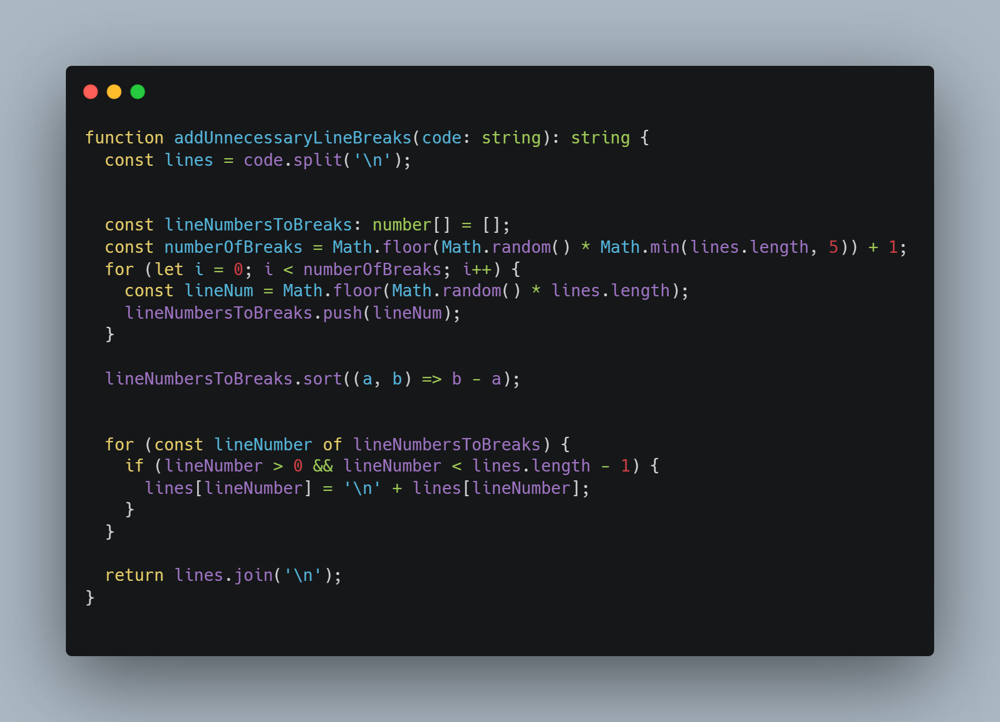

# Shittier - Embrace the Chaos!

Shittier is a one-of-a-kind code formatting tool that embraces disorder and chaos, giving your code a uniquely shittier appearance. While conventional code formatters like Prettier strive for improved readability and consistent formatting, Shittier takes a bold approach, celebrating the beauty of messiness and confusion in your codebase.

# before

# after

## Features

- Embrace Chaos: Emphasize disorder and randomness in your code, breaking free from traditional formatting norms.
- Unpredictable Indentation: Experience a wild ride of varying indentations, ensuring no two lines are the same.
- Random Whitespace: Shittier introduces and removes whitespace between operators, adding to the confusion.
- Random Line Breaks: Bid farewell to tidy line breaks; Shittier adds line breaks wherever it sees fit.
- Inconsistent Bracing Style: Brace yourself for randomness as Shittier switches between different bracing styles.
- Mixed Quotes: Enjoy the uncertainty of mixed quotes as Shittier playfully alternates between single and double quotes.
- Random Funny Comments: Let Shittier entertain you by injecting amusing and unexpected comments into your code.

## Installation

You can install Shittier from the [Visual Studio Code Marketplace](https://marketplace.visualstudio.com/) by searching for "Shittier" or by navigating to the Extensions view and searching for "Shittier."

## How to Use

1. Install the Shittier extension.
2. Open a code file in Visual Studio Code.
3. Use the command palette to find the command "Shittify Current File."
4. Watch as the chaos unfolds and your code turns shittier than ever before!

## Configuration

yet to be implemented...

## Contributing

 Contributions are welcome anytime, together, to make it shittier [GitHub repository](https://github.com/raid-teyar/raidteyar-shittier).

## License

Shittier is released under the [MIT License](https://opensource.org/licenses/MIT).

## Disclaimer

Shittier is meant for experimental and entertainment purposes only. Please use it responsibly and do not apply Shittier to production code or critical projects. The creators and contributors of Shittier are not responsible for any resulting chaos or confusion caused by its usage.

## About

Shittier was born out of a desire to challenge the norms of code formatting and explore the uncharted territory of code chaos. 

Note: Shittier is a satirical project and intended to be humorous. We acknowledge the importance of well-formatted and readable code in real-world development scenarios. Happy coding!
